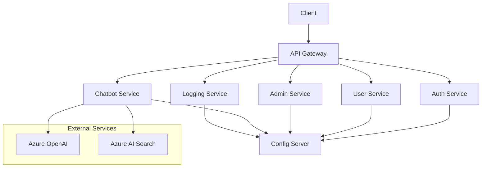

# BotChat System Architecture Documentation

## System Overview
BotChat is a microservices-based chatbot platform that leverages Azure OpenAI and Azure AI Search to provide intelligent conversational capabilities through RAG (Retrieval-Augmented Generation). The system is built primarily using Spring Boot microservices with a Python FastAPI service handling the core chatbot functionality.

## Architecture Components

### Core Services

#### 1. Chatbot Service (Port: 8000)
- **Technology**: Python FastAPI
- **Purpose**: Core chatbot engine implementation
- **Key Features**:
  - Integration with Azure OpenAI for natural language processing
  - Azure AI Search implementation for RAG
  - Real-time chat processing
  - Knowledge base retrieval and context augmentation

#### 2. API Gateway (Port: 8080)
- **Technology**: Spring Boot
- **Purpose**: Single entry point for all client requests
- **Key Features**:
  - Request routing
  - Load balancing
  - Request/response transformation
  - Authentication and authorization forwarding
  - Rate limiting

#### 3. Config Server (Port: 8888)
- **Technology**: Spring Boot
- **Purpose**: Centralized configuration management
- **Key Features**:
  - Externalized configuration for all services
  - Environment-specific configurations
  - Dynamic configuration updates

### Supporting Services

#### 4. Auth Service (Port: 8082)
- **Technology**: Spring Boot
- **Purpose**: Authentication and authorization management
- **Key Features**:
  - User authentication
  - JWT token generation and validation
  - Role-based access control
  - Security policy enforcement

#### 5. User Service (Port: 8084)
- **Technology**: Spring Boot
- **Purpose**: User management and profiles
- **Key Features**:
  - User CRUD operations
  - Profile management
  - User preferences
  - User data persistence

#### 6. Admin Service (Port: 8081)
- **Technology**: Spring Boot
- **Purpose**: Administrative operations and system management
- **Key Features**:
  - System configuration
  - User management
  - Service monitoring
  - Administrative dashboard backend

#### 7. Logging Service (Port: 8083)
- **Technology**: Spring Boot
- **Purpose**: Centralized logging and monitoring
- **Key Features**:
  - Log aggregation
  - Audit trailing
  - System metrics collection
  - Error tracking

### Infrastructure

#### Database
- **Technology**: PostgreSQL
- **Purpose**: Primary data storage
- **Configuration**:
  - Default port: 5432
  - Configurable username/password
  - Persistent storage

#### Networking
- Custom bridge network (`botchat-network`)
- Internal service discovery
- Isolated network space for security

## Service Dependencies

## Deployment Configuration

### Environment Variables
Each service requires specific environment variables:
- `SPRING_PROFILES_ACTIVE`: Environment profile (dev, prod)
- Database credentials for PostgreSQL
- Azure OpenAI API credentials
- Azure AI Search credentials

### Health Checks
- Config Server implements health checks
- Other services depend on Config Server's health status
- 30-second intervals with 3 retries

### Port Mappings
All services expose internal ports to host machine:
- Config Server: 8888
- API Gateway: 8080
- Admin Service: 8081
- Auth Service: 8082
- Logging Service: 8083
- User Service: 8084
- Chatbot Service: 8000

## Security Considerations

1. **Database Security**
   - Secure password configuration
   - Network isolation
   - Regular backup procedures

2. **Service Security**
   - JWT-based authentication
   - Role-based access control
   - API Gateway security filters
   - HTTPS enforcement in production

3. **Network Security**
   - Isolated bridge network
   - Internal service communication only
   - Limited port exposure

## Development Guidelines

1. **Service Development**
   - Follow Spring Boot best practices
   - Implement circuit breakers
   - Include comprehensive logging
   - Write unit and integration tests

2. **API Development**
   - RESTful API design
   - OpenAPI/Swagger documentation
   - Version control
   - Rate limiting implementation

3. **Monitoring**
   - Actuator endpoints
   - Metrics collection
   - Log aggregation
   - Performance monitoring

## RAG Implementation Details

The Chatbot Service implements RAG using the following components:

1. **Azure OpenAI Integration**
   - Language model for response generation
   - Context processing
   - Natural language understanding

2. **Azure AI Search**
   - Knowledge base indexing
   - Semantic search capabilities
   - Context retrieval
   - Document embedding

3. **RAG Pipeline**
   - Query processing
   - Context retrieval
   - Response generation
   - Answer synthesis

## Scaling Considerations

1. **Horizontal Scaling**
   - Stateless service design
   - Container orchestration ready
   - Load balancer configuration

2. **Vertical Scaling**
   - Resource allocation adjustment
   - Database optimization
   - Cache implementation

3. **Performance Optimization**
   - Connection pooling
   - Caching strategies
   - Async processing
   - Batch operations
